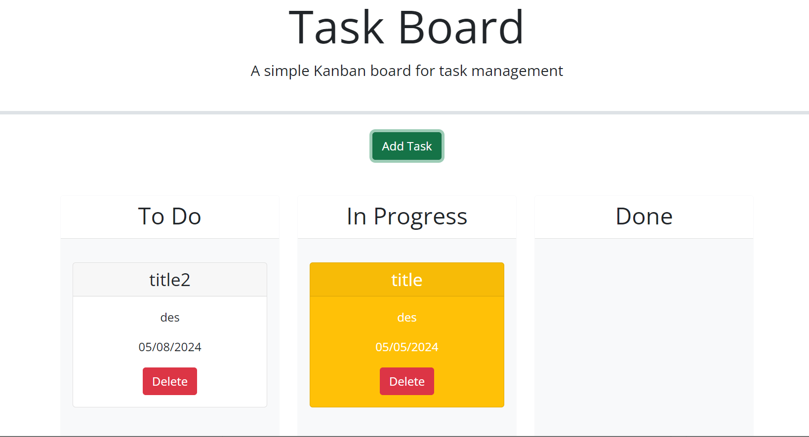
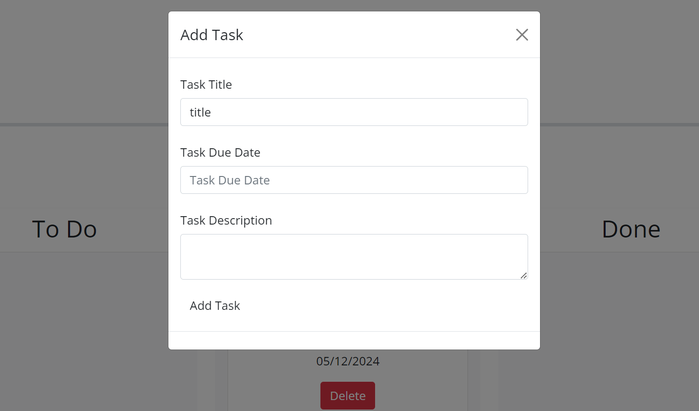
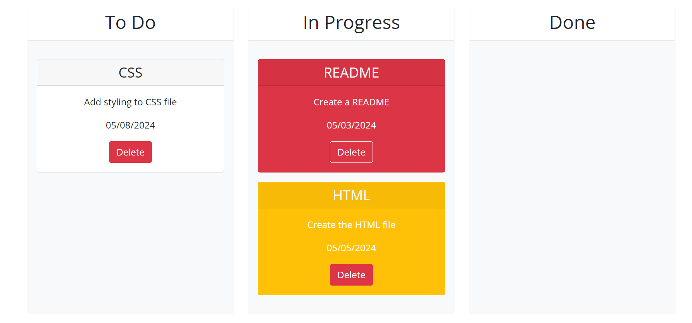

# Task Board

A simple task board application that allows a team to manage project tasks by modifying starter code given.

## Description

The application can be simply described as a task board that allows any team to manage different tasks, assign them to each team member and keep a track of it.  This app will run in the browser and feature dynamically updated HTML and CSS powered by jQuery.

The following animation demonstrates the application functionality: 

## Getting Started
The application can be simply accesed using the link of the GitHub Pages. The following image demonstrates the web application's appearance:

A modal form opnes up by clicking the Add Task button on the page where user can input the task details like title,due date and description. The modal form looks like the following image:

Once the tasks are added, they will be stored to the localStorage and will be displayed in the colums in the application. Based on the status of the task, a color theme will be applied to the respective task cards. The following image shows the color theme for taskcards based on due date:

### Dependencies

* none

### Installing

* No installation required. The application is deployed using GitHub Pages

### Executing program

* The application can accesed directly using the link:
[GitHubPage-Taskboard](https://aniraannu.github.io/task-board/)

## Help

NA

## Authors

Contributors names and contact info

Anira Raveendran
[@aniraannu](https://github.com/aniraannu)

## Version History

* 0.1
    * Initial Release

## License

None

## Acknowledgments

Inspiration, code snippets, etc.

* [dbader](https://github.com/dbader/readme-template)
